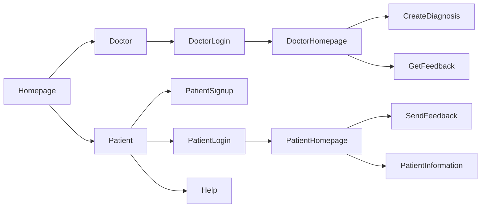
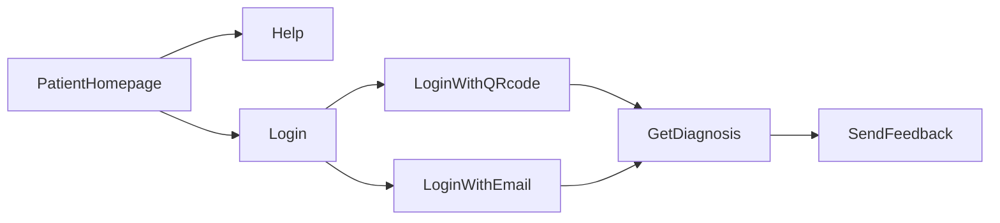
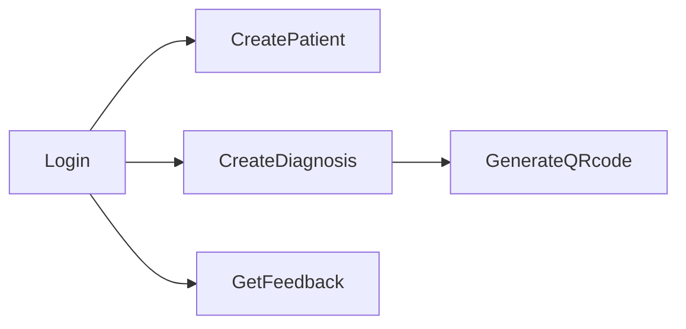

# Prototype for client

Client Structure

```mermaid
graph LR;
    Homepage-->Doctor;
    Homepage-->Patient;
    Patient-->PatientSignup;
    Patient-->PatientLogin;
    Patient-->Help;
    PatientLogin-->PatientHomepage;
    PatientHomepage-->SendFeedback;
    PatientHomepage-->PatientInformation;
    Doctor-->DoctorLogin;
    DoctorLogin-->DoctorHomepage;
    DoctorHomepage-->CreateDiagnosis;
    DoctorHomepage-->GetFeedback;
```

# Client Workflow
Workflow design for clients, page to page, can be modified as user manual in the end.

## Patient

```mermaid
  graph LR;
      PatientHomepage-->Help;;
      PatientHomepage-->Login;
      Login-->LoginWithQRcode;
      Login-->LoginWithEmail;
      LoginWithQRcode-->GetDiagnosis;
      LoginWithEmail-->GetDiagnosis;
      GetDiagnosis-->SendFeedback;
```

## Doctor

```mermaid
  graph LR;
      Login-->CreatePatient;
      Login-->CreateDiagnosis;
      Login-->GetFeedback;
      CreateDiagnosis-->GenerateQRcode;
```
